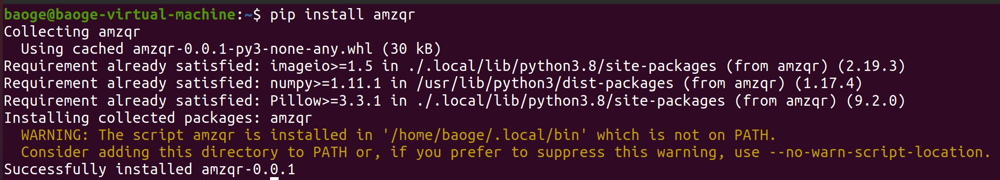
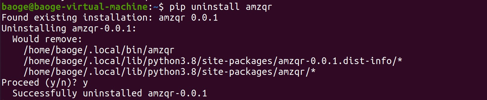
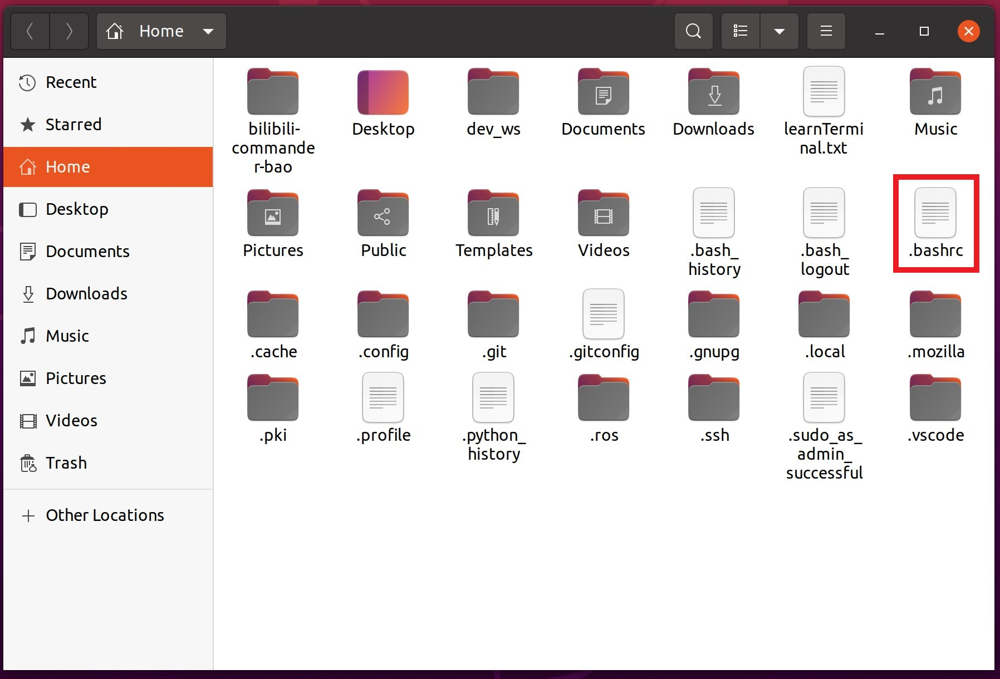
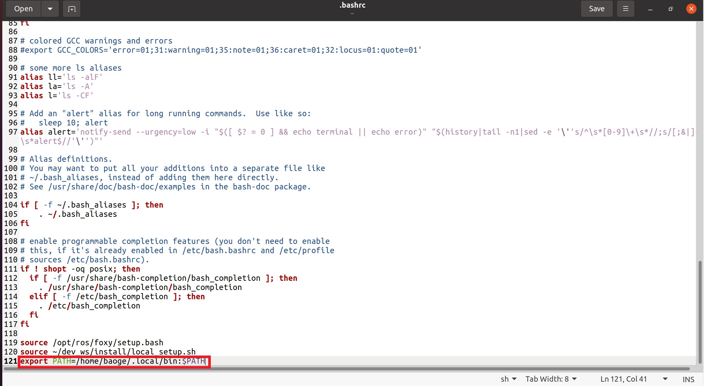
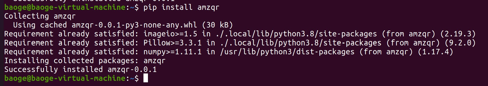
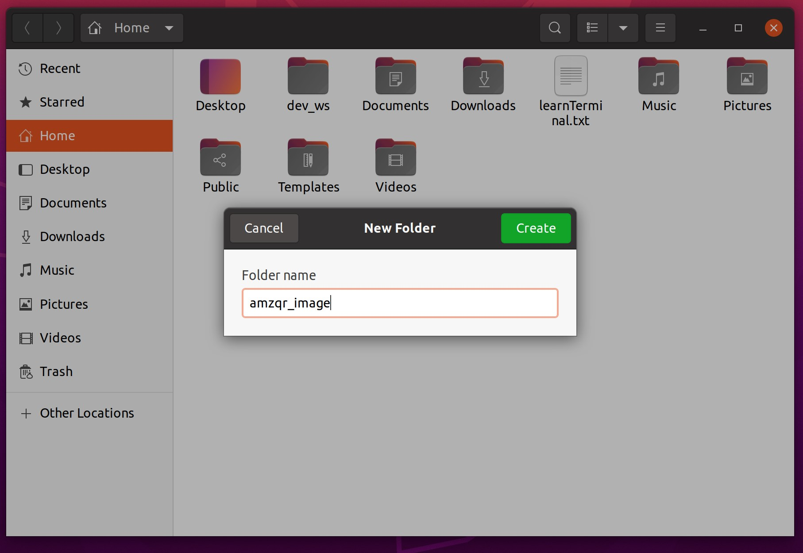
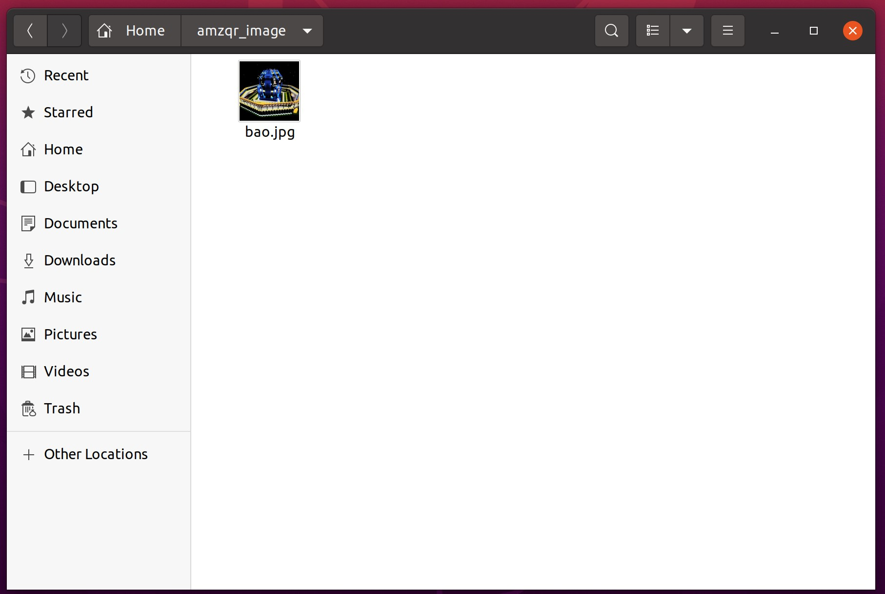
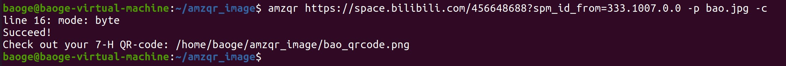
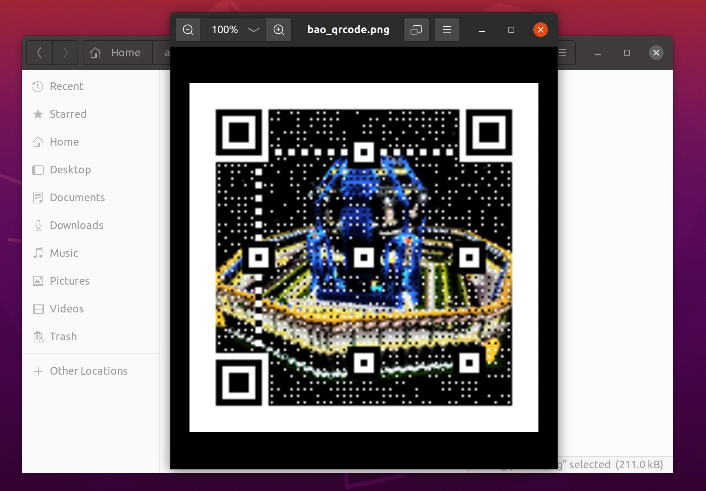

# 利用Amazing-QR生成艺术二维码

## 按照GitHub上的教程，用pip install安装Amazing-QR，提示warning，说我的amzqr不在路径中，先用pip uninstall卸载Amazing-QR

## 打开文件资源管理器，按ctrl + h显示隐藏的文件，找到这个.bashrc文件

## 打开后在最后一行把刚才报warning的路径添加到里面，ctrl + s保存退出

## 再次打开终端，输入一行source ~/.bashrc

## 重新输入pip install amzqr，这回没报warning，问题解决了

## 新建一个文件夹，命名成amzqr_image

## 在终端进入这个文件夹，提前在里面放一些图片

## 在终端输入命令amzqr https://space.bilibili.com/456648688?spm_id_from=333.1007.0.0 -p bao.jpg -c

## 显示生成成功了，打开看看

# 原教程网址 https://github.com/x-hw/amazing-qr
